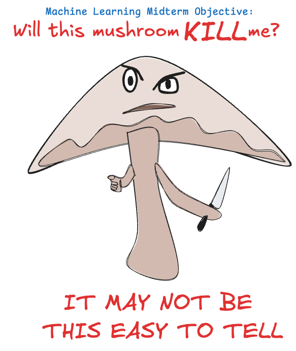

### Peer Review:
As part of the project I am review Aaron Gillespie

 #### Git Link: https://github.com/aarongilly/44-670-midterm

#### Nootbook Link: https://github.com/aarongilly/44-670-midterm/blob/main/midterm_gillespie.ipynb

Peer Introductio Of Notebook:
Date: 2025-04-01
Objective:

build a classifier using machine learning
present the classifier & demonstrate understanding of underlying concepts
document the process
submit as NW Missouri University CSIS 44-670 midterm
We have a dataset about mushrooms, some of which are safe, others not.
Our goal is to build a machine learning classifier capable of predicting whether or not mushrooms are poisonous.

[!warning] Disclaimer: This work should not be used in determining whether or not you should eat a mushroom you find. Just don't.

## MY Review : 
Aaron Gillespie's this funny pic introduction makes me so funny but  it still well organised project.

### 1. Clarity & Organization

The notebook of Aaron Gillespie is well-structured and easy to follow. Each step of the process, from data loading to model evaluation, is clearly presented. The comments are helpful, though additional section headers or explanations between blocks could improve readability further. Consider adding more summaries at the end of each section for the reader.

### 2. Feature Selection & Justification

The features chosen for this project seem appropriate given the objective of predicting the target variable. However, more justification for why specific features were selected (e.g., based on domain knowledge or correlation analysis) could make the reasoning clearer.

### 3. Model Performance & Comparisons

The models used and their performance metrics are clearly explained. Comparisons between different models are also made. It would be helpful to include a few visual aids, such as bar charts, to better illustrate model performance differences.

### 4. Reflection Quality

The reflections are thoughtful and provide insights into model limitations. To improve, more specific suggestions could be given regarding potential improvements to the model or dataset. For example, could hyperparameter tuning or additional data preprocessing lead to better results?

#### Suggestions for Improvement

I would like to suggest Aaron Gillespie :

Feature Engineering: Try adding or transforming new features and comparing the results.

#### Model Selection: 

Include a wider variety of models or additional ensemble techniques to compare their performance more thoroughly.